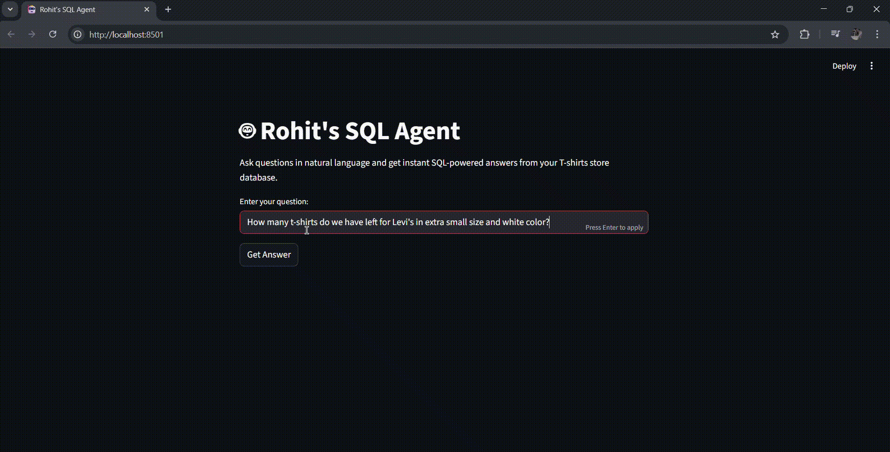

# Text-to-SQL Agent (with Streamlit + LangChain)

This project lets you **talk to your database in plain English**.  
Ask questions like *"How many Adidas T-shirts do I have left in my store?"* and it will:  
1. Convert your question into a proper SQL query  
2. Run it against the database  
3. Return a clean answer in seconds

---

## Demo



---

## Features
- **Natural Language to SQL**: no need to write queries manually
- **Few-shot learning**: improves accuracy with worked examples
- **Streamlit UI**: simple interface to ask questions
- **Intermediate reasoning**: optional view to see how the agent thinks step by step
- **Custom MySQL database**: includes a sample T-shirt store schema (`Database/tshirts_db_creation.sql`)

---

## Tech Stack
- [LangChain](https://www.langchain.com/) (OpenAI, HuggingFace, Chroma)
- [Streamlit](https://streamlit.io/) (UI)
- [MySQL](https://www.mysql.com/) (Database)
- [Python Dotenv](https://pypi.org/project/python-dotenv/) (for secrets)

---

## Project Structure

```
.
├── Database/                     # contains SQL script for sample DB
│   └── tshirts_db_creation.sql
├── .gitignore
├── app.py                        # Streamlit app (UI)
├── langchain_helper.py           # main agent logic
├── few_shots.py                  # few-shot examples
├── requirements.txt              # dependencies
├── assets/                       # screenshots / demo video
│   └── demo.mp4
└── README.md
```

---

## Setup & Installation

1. **Clone the repo**
   ```bash
   git clone https://github.com/your-username/text-to-sql-agent.git
   cd text-to-sql-agent
   ```

2. **Create & activate venv**
   ```bash
   python -m venv .venv
   source .venv/bin/activate    # macOS/Linux
   .venv\Scripts\activate       # Windows
   ```

3. **Install dependencies**
   ```bash
   pip install -r requirements.txt
   ```

4. **Setup database**
   - Start MySQL
   - Run the script in `Database/tshirts_db_creation.sql` to create tables and sample data.

5. **Environment variables**
   - Create a `.env` file in the root with:
   ```env
   OPENAI_API_KEY=your_api_key_here
   ```

---

## Usage

Run the Streamlit app:

```bash
streamlit run app.py
```

Then open http://localhost:8501 in your browser.


---

## Acknowledgements

- LangChain for the powerful agent framework
- Hugging Face for embeddings
- OpenAI for LLM APIs
- Streamlit for the UI

---

## License

[](https://opensource.org/licenses/MIT)

This project is licensed under the MIT License - see the [LICENSE](LICENSE) file for details.

---

## Contributing

Contributions are welcome! Please feel free to submit a Pull Request.