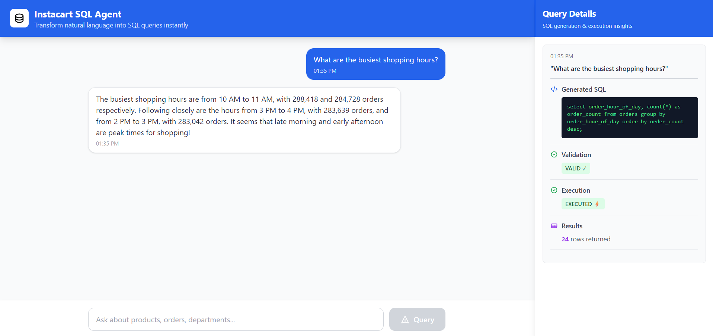
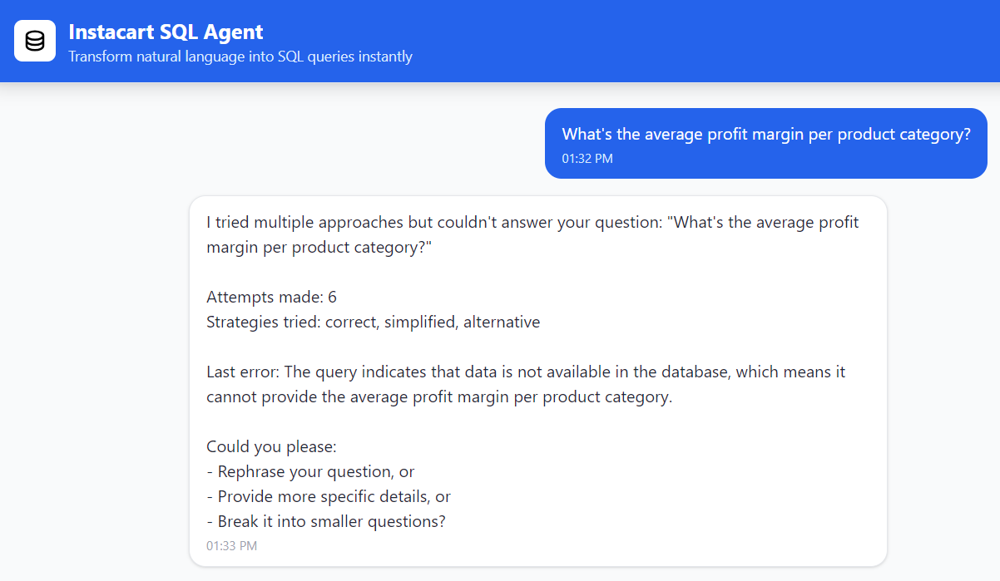
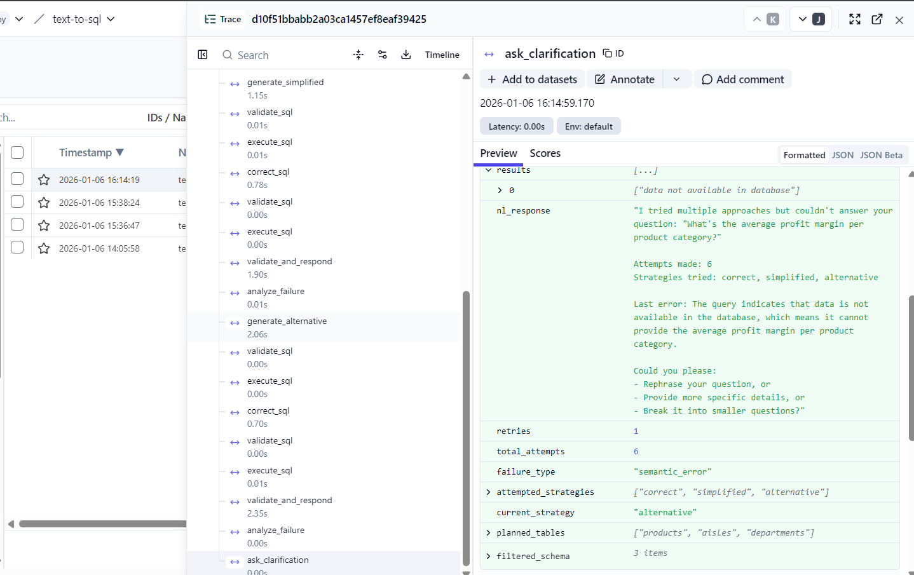

# Agentic Text-to-SQL System 

End-to-end Text-to-SQL system with validation, fallback, safe execution, and observability.

## Key Features

- Agentic Text-to-SQL flow using LangGraph (plan → generate → validate → correct → fallback)
- Schema-aware SQL generation using `schema_summary.yaml`
- SQL validation and safe execution guardrails
- Self-correction and retry for invalid or ambiguous queries
- Human-readable answers from query results
- FastAPI backend with lightweight frontend
- Observability with Langfuse; Prometheus & Grafana (planned: RPS, P95, failures)

## Architecture Diagram 


## Output Examples

### Normal Query (UI ↔ Agent Tracing)

**Frontend UI result:**
<p align="center">
  
</p>

**Langfuse trace showing successful agent execution:**
<p align="center">
  
</p>


### Impossible / Unsupported Query (UI ↔ Agent Tracing)

**Frontend UI response:**
<p align="center">
  
</p>

**Langfuse trace showing retries and graceful failure:**
<p align="center">
  
</p>


### System Monitoring

**Grafana Metrics Dashboard**  
<p align="center">
  
</p>

## Running the Application

### Prerequisites

- Python 3.10+
- PostgreSQL (running locally)
- Kaggle account
- Docker
- OpenAI API

### Setup

### 1. Clone and Configure

```bash
git clone https://github.com/7rohxt/agentic-text-to-sql-system.git
cd agentic-text-to-sql-system
```

Create a `.env` file with your database credentials:

```bash
DB_HOST=localhost
DB_PORT=5432
DB_NAME=instacart_db
DB_USER=postgres
DB_PASSWORD=your_password
```

### 2. Set Up Database

Create the database:

```bash
psql -U postgres -c "CREATE DATABASE instacart_db;"
```

Load the Instacart dataset by running the setup notebook:

```bash
jupyter notebook notebooks/01_instacart_data_setup.ipynb
```

### 3. Run the API

```bash
python -m venv .venv
source .venv/bin/activate  # Windows: .venv\Scripts\activate
pip install -r requirements.txt
uvicorn backend_server.app:app --reload
```

API available at: `http://localhost:8000`

### Observability (Optional)

### Langfuse (LLM Tracing)

Add to your `.env` file:

```bash
LANGFUSE_PUBLIC_KEY=your_public_key
LANGFUSE_SECRET_KEY=your_secret_key
LANGFUSE_HOST=https://cloud.langfuse.com
```

### Prometheus & Grafana

```bash
# Prometheus (metrics at /metrics)
docker run -d -p 9090:9090 \
  -v ./observability/prometheus/prometheus.yml:/etc/prometheus/prometheus.yml \
  --name prometheus prom/prometheus

# Grafana (optional visualization)
docker run -d -p 3000:3000 --name grafana grafana/grafana
```

Grafana: `http://localhost:3000` (admin/admin)

## Folder Structure

```text
.
├── assets/                      # Architecture diagrams, UI screenshots, demo outputs
│
├── backend_server/              # FastAPI backend service
│   └── app.py                   # API entry point (query endpoint, CORS, routing)
│
├── front_end/                   # Lightweight static frontend
│   └── index.html               # UI for submitting queries and viewing results
│
├── notebooks/                   # Experiments, debugging, and exploratory notebooks
│
├── src/                         # Core Text-to-SQL agent logic
│   ├── __init__.py              # Marks src as a Python package
│   │
│   ├── agent/                   # LangGraph-based SQL agent
│   │   ├── agent.py             # SQLAgent orchestration logic
│   │   ├── nodes.py             # Agent nodes (generate, validate, retry, execute)
│   │   ├── routing.py           # Control flow and fallback routing
│   │   └── state.py             # Shared agent state definition
│   │
│   ├── config/                  # Centralized configuration
│   │   └── settings.py          # Constants, limits, retries, environment configs
│   │
│   ├── db/                      # Database interaction layer
│   │   └── db_connection.py     # DB connection and safe SQL execution
│   │
│   ├── prompts/                 # Prompt templates
│   │   └── templates.py         # SQL generation and reasoning prompts
│   │
│   ├── schema/                  # Database schema context
│   │   └── schema_summary.yaml  # Condensed schema used by the LLM
│   │
│   └── utils/                   # Shared utility helpers
│       ├── llm.py               # LLM initialization and configuration helpers
│       ├── print_result.py      # Pretty-printing and formatting agent outputs
│       ├── schema_utils.py      # Schema loading and manipulation helpers
│       └── sql_utils.py         # SQL cleaning and normalization helpers
│
├── .gitignore                   # Git ignore rules
├── README.md                    # Project documentation
├── main.py                      # Programmatic entry point for the SQL agent
├── requirements.txt             # Python dependencies
└── .env                         # Environment variables (excluded from version control)
```

## Acknowledgements

- **FastAPI** — for building a clean, high-performance backend API
- **LangChain** — for LLM orchestration and prompt-driven reasoning
- **LangGraph** — for constructing structured, multi-step agent workflows
- **OpenAI** — for large language models used in SQL generation
- **PostgreSQL** — as the target relational databases for SQL execution
- **Pytest** — for validating agent behavior and failure handling
- **Langfuse** — for LLM tracing and debugging (planned integration)
- **Prometheus** and **Grafana** — for metrics, monitoring, and alerting (planned integration)

## License

[](https://opensource.org/licenses/MIT)

This project is licensed under the **MIT License**.  
See the [LICENSE](LICENSE) file for details.

## Contributing

Contributions are welcome — please open an issue or submit a pull request with a clear description of your changes.